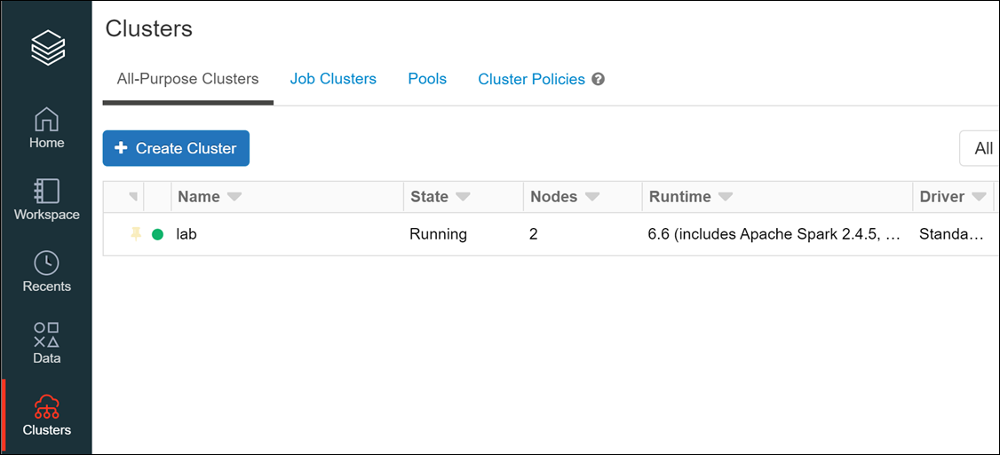
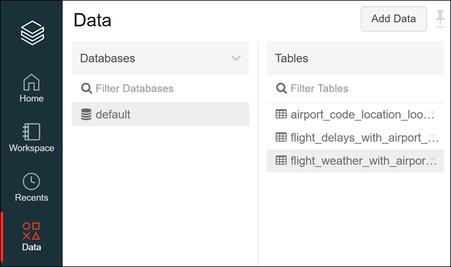

# Big data and visualization team challenge

<!-- TOC -->

- [Big data and visualization team challenge](#big-data-and-visualization-team-challenge)
  - [Abstract and learning objectives](#abstract-and-learning-objectives)
  - [Overview](#overview)
  - [Solution architecture](#solution-architecture)
  - [Requirements](#requirements)
  - [Exercise 1: Retrieve lab environment information and create Databricks cluster](#exercise-1-retrieve-lab-environment-information-and-create-databricks-cluster)
    - [Task 1: Retrieve Azure Storage account information and Subscription Id](#task-1-retrieve-azure-storage-account-information-and-subscription-id)
    - [Task 2: Create an Azure Databricks cluster](#task-2-create-an-azure-databricks-cluster)
  - [Exercise 2: Load Sample Data and Databricks Notebooks](#exercise-2-load-sample-data-and-databricks-notebooks)
    - [Task 1: Upload the Sample Datasets](#task-1-upload-the-sample-datasets)
    - [Task 2: Open Azure Databricks and complete lab notebooks](#task-2-open-azure-databricks-and-complete-lab-notebooks)
  - [Exercise 3: Setup Azure Data Factory](#exercise-3-setup-azure-data-factory)
    - [Task 1: Download and stage data to be processed](#task-1-download-and-stage-data-to-be-processed)
    - [Task 2: Install and configure Azure Data Factory Integration Runtime on your machine](#task-2-install-and-configure-azure-data-factory-integration-runtime-on-your-machine)
    - [Task 3: Configure Azure Data Factory](#task-3-configure-azure-data-factory)
  - [Exercise 4: Develop a data factory pipeline for data movement](#exercise-4-develop-a-data-factory-pipeline-for-data-movement)
    - [Task 1: Create copy pipeline using the Copy Data Wizard](#task-1-create-copy-pipeline-using-the-copy-data-wizard)
  - [Exercise 5: Operationalize ML scoring with Azure Databricks and Data Factory](#exercise-5-operationalize-ml-scoring-with-azure-databricks-and-data-factory)
    - [Task 1: Create Azure Databricks Linked Service](#task-1-create-azure-databricks-linked-service)
    - [Task 2: Trigger workflow](#task-2-trigger-workflow)
  - [Exercise 6: Summarize data using Azure Databricks](#exercise-6-summarize-data-using-azure-databricks)
    - [Task 1: Summarize delays by airport](#task-1-summarize-delays-by-airport)
  - [Exercise 7: Visualizing in Power BI Desktop](#exercise-7-visualizing-in-power-bi-desktop)
    - [Task 1: Obtain the JDBC connection string to your Azure Databricks cluster](#task-1-obtain-the-jdbc-connection-string-to-your-azure-databricks-cluster)
    - [Task 2: Connect to Azure Databricks using Power BI Desktop](#task-2-connect-to-azure-databricks-using-power-bi-desktop)
  - [After the team challenge](#after-the-team-challenge)
    - [Task 1: Delete resource group](#task-1-delete-resource-group)

<!-- /TOC -->

## Abstract and learning objectives

This team challenge is designed to provide exposure to many of Microsoft's transformative line of business applications built using Microsoft big data and advanced analytics.

By the end of the challenge, you will be able to show an end-to-end solution, leveraging many of these technologies, but not necessarily doing work in every component possible.

## Overview

Margie's Travel (MT) provides concierge services for business travelers. In an increasingly crowded market, they are always looking for ways to differentiate themselves, and provide added value to their corporate customers.

They are looking to pilot a web app that their internal customer service agents can use to provide additional information useful to the traveler during the flight booking process. They want to enable their agents to enter in the flight information and produce a prediction as to whether the departing flight will encounter a 15-minute or longer delay, considering the weather forecasted for the departure hour.

## Solution architecture

Below is a diagram of the solution architecture you will build in this challenge. Please study this carefully so you understand the whole of the solution as you are working on the various components.

![The high-level overview diagram of the end-to-end solution is displayed. Flight delay data and historical airport weather data are provided to Azure Data Factory. Azure Data Factory provides this data to both blob storage and Azure Databricks. Azure Databricks scores the data and saves the results to an Azure SQL Database. Azure Databricks also creates, trains, and exports a machine learning model to the Azure Machine Learning Service. Azure Machine Learning service provides a containerized services that is consumed by the web portal. The web portal also consumes 3rd party API data for forecasted weather. Map data visualization is provided by Power BI using web portal information and the Azure SQL database.](../wds/media/high-level-overview.png 'High-level overview diagram')

## Requirements

1. Microsoft Azure subscription must be pay-as-you-go or MSDN.

   - Trial subscriptions will not work.

## Exercise 1: Retrieve lab environment information and create Databricks cluster

Duration: 10 minutes

In this exercise, you will retrieve your Azure Storage account name and access key and your Azure Subscription Id and record the values to use later within the lab. You will also create a new Azure Databricks cluster.

### Task 1: Retrieve Azure Storage account information and Subscription Id

You will need to have the Azure Storage account name and access key when you create your Azure Databricks cluster during the lab. You will also need to create storage containers in which you will store your flight and weather data files.

1. From the side menu in the Azure portal, choose **Resource groups**, then enter your resource group name into the filter box, and select it from the list.

2. Next, select your lab Azure Storage account from the list.

   

3. On the left menu, select **Overview**, locate and copy your Azure **Subscription ID** and save to a text editor such as Notepad for later.

   

4. Select **Access keys** (1) from the menu. Copy the **storage account name** (2) and the **key1** key (3) and copy the values to a text editor such as Notepad for later.

   

### Task 2: Create an Azure Databricks cluster

You have provisioned an Azure Databricks workspace, and now you need to create a new cluster within the workspace. Part of the cluster configuration includes setting up an account access key to your Azure Storage account, using the Spark Config within the new cluster form. This will allow your cluster to access the lab files.

*Tasks to complete:*

- Launch your Azure Databricks workspace.
- Create a new cluster

*Exit criteria:*

- You have a cluster created and running with the following configuration:

  - **Cluster Name**: `lab`

  - **Cluster Mode**: **Standard**

  - **Pool**: Select **None**

  - **Databricks Runtime Version**: **Runtime: 6.6 (Scala 2.11, Spark 2.4.5)** (**Note**: the runtime version CANNOT be > 6.6, due to compatibility issues with the supplied notebooks.)

  - **Enable Autoscaling**: **Uncheck** this option.

  - **Terminate after**: **Check** the box and enter `120`

  - **Worker Type**: **Standard_F4s**

  - **Driver Type**: **Same as worker**

  - **Workers**: `1`

  - **Spark Config**: Expand Advanced Options and edit the Spark Config by entering the connection information for your Azure Storage account that you copied above in Task 1. This will allow your cluster to access the lab files. Enter the following:

   `spark.hadoop.fs.azure.account.key.<STORAGE_ACCOUNT_NAME>.blob.core.windows.net <ACCESS_KEY>`, where <STORAGE_ACCOUNT_NAME> is your Azure Storage account name, and <ACCESS_KEY> is your storage access key.

  **Example:** `spark.hadoop.fs.azure.account.key.bigdatalabstore.blob.core.windows.net HD+91Y77b+TezEu1lh9QXXU2Va6Cjg9bu0RRpb/KtBj8lWQa6jwyA0OGTDmSNVFr8iSlkytIFONEHLdl67Fgxg==`

  

## Exercise 2: Load Sample Data and Databricks Notebooks

Duration: 60 minutes

In this exercise, you will implement a classification experiment. You will load the training data from your local machine into a dataset. Then, you will explore the data to identify the primary components you should use for prediction, and use two different algorithms for predicting the classification. You will then evaluate the performance of both algorithms and choose the algorithm that performs best. The model selected will be exposed as a web service that is integrated with the optional sample web app at the end.

### Task 1: Upload the Sample Datasets

*Tasks to complete:*

- Download the three CSV sample datasets from here: <http://bit.ly/2wGAqrl> (If you get an error, or the page won't open, try pasting the URL into a new browser window and verify the case sensitive URL is exactly as shown). If you are still having trouble, a zip file called AdventureWorksTravelDatasets.zip is included in the lab-files folders.
- Upload the files to the default database:
  - Set first row as header and *do not* infer schema.
  - `flightdelayswithairportcodes_csv` renamed to **flight_delays_with_airport_codes**
  - `flightweatherwithairportcode_csv` renamed to **flight_weather_with_airport_code**
  - `airportcodelocationlookupclean_csv` renamed to **airport_code_location_lookup_clean**

*Exit criteria:*

- Three new tables created:

   

### Task 2: Open Azure Databricks and complete lab notebooks

*Tasks to complete:*

- Import Databricks notebooks into the workspace under your user account: [Download DBC file](BigDataVis.dbc?raw=true).
- Complete the two notebooks contained within the `Exercise 2` folder.

*Exit criteria:*

- You have successfully executed `01 Data Preparation` and `02 Train and Evaluate Models`.

> Do NOT run any notebooks within the Exercise 5 or 6 folders. They will be discussed later in the lab.

## Exercise 3: Setup Azure Data Factory

Duration: 20 minutes

In this exercise, you will create a baseline environment for Azure Data Factory development for further operationalization of data movement and processing. You will create a Data Factory service, and then install the Data Management Gateway which is the agent that facilitates data movement from on-premises to Microsoft Azure.

### Task 1: Download and stage data to be processed

*Tasks to complete:*

- Download the AdventureWorks sample data from <http://bit.ly/2zi4Sqa>.

*Exit criteria:*

- You have downloaded and extracted the data to a new folder called **C:\\Data**.

### Task 2: Install and configure Azure Data Factory Integration Runtime on your machine

*Tasks to complete:*

- Download and install the latest version of Azure Data Factory Integration Runtime: <https://www.microsoft.com/en-us/download/details.aspx?id=39717>.

*Exit criteria:*

- The Azure Data Factory Integration Runtime is installed and running on your system. Keep it open for now. You will come back to this screen once the Data Factory in Azure has been provisioned, and obtain the gateway key so we can connect Data Factory to this "on-premises" server.

   

### Task 3: Configure Azure Data Factory

*Tasks to complete:*

- Create a new Integration Runtime (gateway), and connect it to the Azure Data Factory Integration Runtime running on your machine.

*Exit criteria:*

- You have authored an Integration Runtime in ADF, and successfully connected it to the ADF Integration Runtime on your machine. You should see a screen like the following:

    

    

## Exercise 4: Develop a data factory pipeline for data movement

Duration: 20 minutes

In this exercise, you will create an Azure Data Factory pipeline to copy data (.CSV files) from an on-premises server (your machine) to Azure Blob Storage. The goal of the exercise is to demonstrate data movement from an on-premises location to Azure Storage (via the Integration Runtime).

### Task 1: Create copy pipeline using the Copy Data Wizard

*Tasks to complete:*

- Use the Copy Data tool in ADF to generate a Copy Pipeline, moving data from your "on-premises" machine, to the Azure Storage account that was provisioned in the lab setup.

  - The pipeline should run regularly, once per month.

  - Start date is 03/01/2017 12:00 am.

  - For the source:

    - Use a File System source.

    - Choose the path C:\\Data\\FlightsAndWeather.

    - Ensure files copied recursively.

  - For the destination:

    - Use Azure Blob Storage.

    - Make sure you select the storage account you created during lab setup.

    - The folder path should be something like: `sparkcontainer/FlightsAndWeather/{yyyy}/{MM}/`.

    - Add a header to the file.

    - Set the Copy performance settings to have a degree of copy parallelism of 10 and to skip incompatible rows.

    - Update the Copy settings to set the number of retries to 3.

  - Deploy the pipeline.

*Exit criteria:*

- On the **Deployment** screen you will see a message that the deployment in is progress, and after a minute or two that the deployment completed.

   

## Exercise 5: Operationalize ML scoring with Azure Databricks and Data Factory

Duration: 20 minutes

In this exercise, you will extend the Data Factory to operationalize the scoring of data using the previously created machine learning model within an Azure Databricks notebook.

### Task 1: Create Azure Databricks Linked Service

*Tasks to complete:*

- Update the **Exercise 5/01 Deploy for Batch Scoring** notebook in Azure Databricks and **replace `STORAGE-ACCOUNT-NAME`** with the name of your blob storage account.

- Create a new Azure Databricks Linked Service in ADF by adding a new Notebook activity to the design surface, named BatchScore. Choose existing Azure Databricks workspace, then select existing interactive cluster.

  - Generate an Azure Databricks user token and use that as your access token for the linked Azure Databricks service.

  - Input your cluster Id, which is found within the Tags tab of your cluster within the Azure Databricks UI.

  - Set the Notebook path to **Exercise 5/01 Deploy for Batch Scoring** by browsing to it.

- Publish your pipeline.

*Exit criteria:*

- You have an Azure Databricks Notebook Activity attached to your Copy Activity, and your pipeline has been published.

  

### Task 2: Trigger workflow

*Tasks to complete:*

- Within Azure Data Factory, manually trigger your pipeline. Enter **3/1/2017** into the windowStart parameter before you run.

*Exit criteria:*

- When you monitor your pipeline activity, you see a successful run of your pipeline.

   

   > **Note**: You may need to restart your Azure Databricks cluster if it has automatically terminated due to inactivity.

## Exercise 6: Summarize data using Azure Databricks

Duration: 10 minutes

In this exercise, you will prepare a summary of flight delay data using Spark SQL.

### Task 1: Summarize delays by airport

*Tasks to complete:*

- Within Azure Databricks, open and execute the **Exercise 6/01 Explore Data** notebook.

*Exit criteria:*

- You have created flight delays summary global table, which can be queried from Power BI Desktop.

## Exercise 7: Visualizing in Power BI Desktop

Duration: 20 minutes

In this exercise, you will create visualizations in Power BI Desktop.

### Task 1: Obtain the JDBC connection string to your Azure Databricks cluster

Before you begin, you must first obtain the JDBC connection string to your Azure Databricks cluster.

*Tasks to complete:*

- In Azure Databricks, go to Clusters and select your cluster.

- On the cluster edit page, scroll down and select the JDBC/ODBC tab.

  

- On the JDBC/ODBC tab, copy and save the JDBC URL.

  - Construct the JDBC server address that you will use when you set up your Spark cluster connection in Power BI Desktop.

  - Take the JDBC URL that you copied and saved in step 3 and do the following:

  - Replace `jdbc:spark` with `https`.

  - Remove everything in the path between the port number and sql, retaining the components indicated by the boxes in the image below. Also remove `;AuthMech=3;UID=token;PWD=<personal-access-token>` from the end of the string.

  

*Exit criteria:*

- You have created a JDBC connection string similar to <https://adb-6784833592075405.5.azuredatabricks.net:443/sql/protocolv1/o/6784833592075405/0615-225254-need937>.

### Task 2: Connect to Azure Databricks using Power BI Desktop

*Tasks to complete:*

- Launch Power BI Desktop.

- Connect to your Azure Databricks Spark instance, and query the global tables you created in the previous exercise.

*Exit criteria:*

- You have successfully connected to your Azure Databricks cluster, and have the fields from the flight_delay_summary global table loaded in the report design surface.

## After the team challenge

Duration: 10 minutes

In this exercise, attendees will deprovision any Azure resources that were created in support of the lab.

### Task 1: Delete resource group

1. Using the Azure portal, navigate to the Resource group you used throughout this hands-on lab by selecting **Resource groups** in the menu.

2. Search for the name of your research group and select it from the list.

3. Select **Delete** in the command bar and confirm the deletion by re-typing the Resource group name and selecting **Delete**.

You should follow all steps provided _after_ attending the Hands-on lab.
