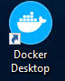
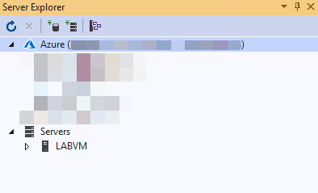

# IoT and the Smart City before the hands-on lab setup guide

**Contents**

<!-- TOC -->

- [IoT and the Smart City before the hands-on lab setup guide](#iot-and-the-smart-city-before-the-hands-on-lab-setup-guide)
  - [Requirements](#requirements)
  - [Before the hands-on lab](#before-the-hands-on-lab)
    - [Task 1: Perform a deployment of the LABVM](#task-1-perform-a-deployment-of-the-labvm)
    - [Task 2: Validate connectivity to Azure](#task-2-validate-connectivity-to-azure)
    - [Task 3: Download lab artifacts](#task-3-download-lab-artifacts)

<!-- /TOC -->

## Requirements

- Microsoft Azure subscription (non-Microsoft subscription) where you are at least a co-administrator.

- **Global Administrator role** for Azure AD within your subscription.

- Local machine or a virtual machine configured with:

>**Note**:  Included below is instruction on automating the creation of an Azure VM that includes all of the necessary software to complete the labs.  Perform Task 1 **only** if you do not want to run locally. **It is important to complete these steps the day before the lab**!

  - Visual Studio Code version 1.38.1 or higher

    - <https://code.visualstudio.com/>

  - Azure IoT Edge extension for Visual Studio Code

    - <https://marketplace.visualstudio.com/items?itemName=vsciot-vscode.azure-iot-edge>

  - C\# for Visual Studio Code (powered by OmniSharp) extension

    - <https://marketplace.visualstudio.com/items?itemName=ms-vscode.csharp>

  - Docker Desktop on the same computer that has Visual Studio Code

    - <https://docs.docker.com/engine/installation/>

  - .NET Core 2.1 SDK
   
    - <https://dotnet.microsoft.com/download/dotnet-core>
  
  - .NET Framework 4.6.1 Dev Pack

    - <https://dotnet.microsoft.com/download/dotnet-framework>

  - Visual Studio Community 2019 or greater, version 16.2.5 or higher

    - <https://www.visualstudio.com/vs/>

  - .NET desktop development workload for Visual Studio 2019

  - ASP.NET and web development workload for Visual Studio 2019

  - Node.js (install using either the 32-bit or 64-bit Windows Installer (.msi) option)

    - <https://nodejs.org/en/download/>

  - Postman app

    - <https://www.getpostman.com/apps>

  - Bash client (such as Git Bash or Bash on Ubuntu for Windows)

    - Instructions for installing the Windows Subsystem for Linux for using Bash: <https://docs.microsoft.com/en-us/windows/wsl/install-win10>

## Before the hands-on lab

**Duration:** 60 minutes

In this exercise, you will set up your environment you will use for the rest of the exercises.

### Task 1: Perform a deployment of the LABVM 

In this task you will perform a deployment of a the VM that will be used during this lab.

1. Open a new private or incognito tab in your web browser, and then connect to [the lab VM](./Lab-files/LabVM/README.md).

2. Press the **Deploy to Azure** button.

    

3. You will need to then authenticate with Azure.

    

4. On the Custom Deployment page, choose to create a new resource group, enter **IoTSmartCity** as the Resource name and select a Location close to you.

5. Next, update the LABVM DNS Name providing a globally unique name 3-24 alpha-numeric characters which are lowercase. Check the I agree to the terms and conditions stated above and then press the Purchase button.

    

> **Note**: The VM will take about 45 minutes to provision. You will need to wait for this deployment to complete prior to continuing.

1. Once the Deployment completes, you can locate your VM in the **IoTSmartCity** Resource group. Open the **LABVM** and select **Connect**.

    

2. Login to the LABVM using the following credentials:

    - **Username**: demouser

    - **Password**: Password.1!!

    

3. A Remote Desktop Warning will appear. Select **Don't ask me again for connections to this computer** and then select **Yes**.

    

4. You will receive a message about allowing your PC to be discoverable. Select **No**.

    

5. Once logged in - Docker Desktop will need to be started. Double-click the *Docker Desktop* icon to start the program. This will take a couple of minutes. You can see the status by pressing the Docker icon in the taskbar to ensure that is reads "Docker is Starting".

    

    

6. When Docker for Windows is up and running you will receive the following message:

    

### Task 2: Validate connectivity to Azure

1. From within the virtual machine, launch **Visual Studio** and validate that you can log in with your Microsoft Account when prompted.

2. Validate connectivity to your Azure subscription. Launch Visual Studio, open **Server Explorer** from the View menu, and ensure that you can connect to your Azure subscription.

  

### Task 3: Download lab artifacts

There are several artifacts that will be used in the team challenge. All of these files are located on GitHub and can be downloaded as follows:

1. From your LABVM, obtain all artifacts by downloading a .zip copy of the IoT and the Smart City GitHub repo.

2. In a web browser, navigate to the [IoT and the Smart City MCW repo](https://github.com/Microsoft/MCW-IoT-And-The-Smart-City).

3. On the repo page, select **Clone or download**, then select **Download ZIP**.

   

4. Right-click the .zip file you downloaded and choose **Extract All...**.

   

5. Set the destination path to **C:\\**, then select **Extract**.

   

6. The lab files are located here: `C:\MCW-IoT-and-the-Smart-City-master\Hands-on lab\Lab-files`.

You should follow all steps provided *before* performing the team challenge.
